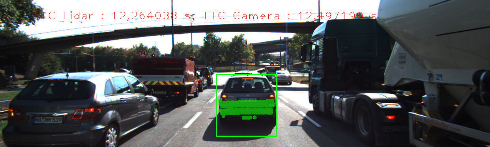

# 3D Object Tracking using Camera and Lidar



# Goal
The goal of the project is to calculate the time to collision (TTC) using both lidar data and Camera images and  to identify the most suitable detector/descriptor combination for TTC estimation and also to search for problems that can lead to faulty measurements by the camera or Lidar sensor

# Introduction

The image here shows the computation blocks for computing the TTC.


In this project, the following are implemented to compute time to collision: 
1. To develop an algorithm to match 3D objects over time by using keypoint correspondences. 
2. Compute the TTC based on Lidar measurements. 
3. Associate keypoint matches to regions of interest and then to compute the TTC based on those matches. 
4. Conduct various tests with the framework. Your goal is to identify the most suitable detector/descriptor combination for TTC estimation, and also to search for problems that can lead to faulty measurements by the camera or Lidar sensor. 

# Match 3D Objects (FP.1)
The aim here is to match the bounding box in the current data frame to the previous data frame. This is done on the basis of keypoint Matches. A bounding box in previous Frame with maximum number of keypoint matches to the current frame bounding box is the right partner. This achieved in two steps. In the inital step, box ids of keypoint in current and previous data frame that are matched by a keypoint match is stored in a multimap.
```
    for(auto it2=matches.begin(); it2!=matches.end(); ++it2){
            
            
            cv::KeyPoint kp_matched_curr = currFrame.keypoints.at(it2->trainIdx);
            cv::KeyPoint kp_matched_prev = prevFrame.keypoints.at(it2->queryIdx);

            int prev_BB_id = -1;
            for (BoundingBox BB:BB_prevFrame) {

                if (BB.roi.contains(kp_matched_prev.pt))
                    prev_BB_id = BB.boxID;

            }
            
            int curr_BB_id = -1;
            for (BoundingBox BB:BB_currentFrame) {

                if (BB.roi.contains(kp_matched_curr.pt))
                    curr_BB_id = BB.boxID;

            }

            prev_curr_BB_ids.insert(std::make_pair(curr_BB_id,prev_BB_id));
            large_prev_id = std::max(large_prev_id,prev_BB_id); // pick the largest box id in prev data frame

        }

```

In the next step, for each bounding box in the current frame, a partner bounding box is selected in the previous frame based on the number of times they jointly occur. A Map is then populated with all the bounding box pairs which will be used for further processing.
```
         for (BoundingBox BB:BB_currentFrame) {

            //cout<<"Box ID"<<BB.boxID<<" "<<prev_curr_BB_ids.count(BB.boxID)<<endl;
            vector<int> count_ids(large_prev_id + 1,0); // vector to count the previous box id recurrence in prev data frame

            // Pick occurences for current bounding box as key
            std::pair< std::multimap<int,int>::iterator,std::multimap<int,int>::iterator > ret;
            ret = prev_curr_BB_ids.equal_range(BB.boxID);

            for(std::multimap<int,int>::iterator it_map = ret.first;it_map!=ret.second;it_map++){
                if (it_map->second != -1)
                    count_ids[it_map->second]++;
            }
 
            int sel_id_prev = std::max_element(count_ids.begin(),count_ids.end()) - count_ids.begin();                   
            bbBestMatches.insert({sel_id_prev,BB.boxID});

            
        }
```


# Compute Lidar-based TTC (FP.2)
To compute Lidar based TTC, the initial step involves finding the 3D point in both previous Data Frame and current Data frame that is closest to the ego car. However, outliers do distort the selection of right point. To eliminate the outliers, i have used median value of the all the Lidar points after sorting them in ascending order. This method is applied to both the lidar point collections in previous and current data frame. Sort function for the lidar points is also implemented.

```
    // compute median values for lidar points in previous and current data frame
    sortLidarPointsinX(lidarPointsPrev);
    mid_value = floor(lidarPointsPrev.size() / 2);
    minXPrev = ( lidarPointsPrev.size() % 2 == 0 ) ? (lidarPointsPrev[mid_value -1].x + lidarPointsPrev[mid_value].x) / 2 : lidarPointsPrev[mid_value].x;


    sortLidarPointsinX(lidarPointsCurr);
    mid_value = floor(lidarPointsCurr.size() / 2);
    minXCurr = ( lidarPointsCurr.size() % 2 == 0 ) ? (lidarPointsCurr[mid_value -1].x + lidarPointsCurr[mid_value].x) / 2 : lidarPointsCurr[mid_value].x;
    
    
    void sortLidarPointsinX(std::vector<LidarPoint> &l_pts){

        std::sort(l_pts.begin(),l_pts.end(),[](LidarPoint pt1,LidarPoint pt2) {
            return pt1.x < pt2.x;
        });

    }
    


```
Once the two points are identified, the TTC can be calculated using the simple formula as given in the image. The time between two data frames
is the inverse of frame rate.


```
    double dT = 1/frameRate;   
    TTC = minXCurr * dT / (minXPrev - minXCurr);

```

# Associate Keypoint Correspondences with Bounding Boxes (FP.3)
The  next step is to calculate TTC using camera, the keypoint matches are needed to be associated with a bounding box obtained by YOLO methods. This is achieved by looping through the keypoint matches, isolating the keypoints that is within the given bounding box. The isolated keypoint matches are then filtered using 1.5 IQR rule by computing the euclidean distances. Based on the threshold computed, the keypoint matches are added to the bounding box.
```
        vector<cv::DMatch> kpm_for_BB;
        vector<double> euclid_dist;


        for (auto it_kpm = kptMatches.begin(); it_kpm != kptMatches.end() - 1; ++it_kpm){

            cv::KeyPoint kpCurr = kptsCurr.at(it_kpm->trainIdx);
            cv::KeyPoint kpPrev = kptsPrev.at(it_kpm->queryIdx);

            if ( boundingBox.roi.contains(kpCurr.pt) ){
                kpm_for_BB.push_back(*it_kpm);
                euclid_dist.push_back( cv::norm( kpCurr.pt - kpPrev.pt) );
            }


        }

        //  Find threshold to filter the Keypoints. The lower limit is zero, threshold limit is calculated based on 1.5 IQR rule         
        sort(euclid_dist.begin(), euclid_dist.end());
        int mid_value = floor(euclid_dist.size() / 2);
        double median_dist = ( euclid_dist.size() % 2 == 0 ) ? (euclid_dist[mid_value -1] + euclid_dist[mid_value]) / 2 : euclid_dist[mid_value];

        double first_Q = euclid_dist[mid_value - (int)(mid_value/2)];
        double thrid_Q = euclid_dist[mid_value + (int)(mid_value/2)];
        double range_Q = thrid_Q - first_Q;

        double low_limit = 0;
        double high_limit = thrid_Q + 1.5 * range_Q;


        auto it2 = kpm_for_BB.begin();
        for(auto it1 = euclid_dist.begin();it1!=euclid_dist.end();++it1,++it2){
            
            double dist = (*it1);
            if( (dist <= high_limit) && (dist >= low_limit)  ){
                boundingBox.kptMatches.push_back((*it2));
                boundingBox.keypoints.push_back( kptsCurr.at(it2->trainIdx) );
            }
            
        }

```


# Compute Camera-based TTC ( FP.4)
The principle of computing the TTC based on camera image involves looping through the keypoint matches that is isolated to the respective bounding boxes in both data frames and calculating the distance ratios between the keypoints in both data frames. These distance ratios are  then stored in a data structure to calculate a statistical mean or median. The median method is preferred as it helps in removing the outliers from the data set. Once the median of distance ratio is identified, the TTC can be computed based on the formula given in the  images below.


```

for (auto it1 = kptMatches.begin(); it1 != kptMatches.end() - 1; ++it1)
    { // outer keypoint loop

        // get current keypoint and its matched partner in the prev. frame
        cv::KeyPoint kpOuterCurr = kptsCurr.at(it1->trainIdx);
        cv::KeyPoint kpOuterPrev = kptsPrev.at(it1->queryIdx);

        for (auto it2 = kptMatches.begin() + 1; it2 != kptMatches.end(); ++it2)
        { // inner keypoint loop

            double minDist = 100.0; // min. required distance

            // get next keypoint and its matched partner in the prev. frame
            cv::KeyPoint kpInnerCurr = kptsCurr.at(it2->trainIdx);
            cv::KeyPoint kpInnerPrev = kptsPrev.at(it2->queryIdx);

            // compute distances and distance ratios
            double distCurr = cv::norm(kpOuterCurr.pt - kpInnerCurr.pt);
            double distPrev = cv::norm(kpOuterPrev.pt - kpInnerPrev.pt);

            if (distPrev > std::numeric_limits<double>::epsilon() && distCurr >= minDist)
            { // avoid division by zero

                double distRatio = distCurr / distPrev;
                distRatios.push_back(distRatio);
            }
        } // eof inner loop over all matched kpts
    }     // eof outer loop over all matched kpts
    
    // Default ratio type is MEDIAN
    sort(distRatios.begin(), distRatios.end());
    int mid_value = floor(distRatios.size() / 2);
    distRatio = ( distRatios.size() % 2 == 0 ) ? (distRatios[mid_value -1] + distRatios[mid_value]) / 2 : distRatios[mid_value];


    double dT = 1 / frameRate;
    TTC = -dT / (1 - distRatio);
    cout<<" distance Ratio ="<<distRati

```

# Performance Evaluation 1 ( FP.5 )

Data collected from Lidar processing


TTC computed based on Lidar data shows some inconsistent time which i believe is way off from the reality, the reasons for that are listed below

1. The computed TTC for image sequences 3-4, 4-5, 11-12, 14-15, 17-18 are off the mark. This evident from the fact, that relative velocity computed between these image sequence are way off their median velocity computed from all image sequences. Since we are using a constant velocity model (CVM), the computed velocities should be close to the average / median velocity.


# Performance Evaluation 2 ( FP.6 )

Data collected from camera processing


In the data sheet above, TTC data is collected using different combinations of detector and descriptor methods. Some combinations failed to produce a result due to various reasons. To orient ourself with the data, i calculated median TTC of all methods for specific image sequence and listed it below. I believe this median data is consistent and represents the reality. However, many of the methods are way off from the median values. Primary reason is the outliers keypoints in the bounding box which distort the median value of distance ratio's and hence way off mark TTC's. I selected only the most reliable combinations and plotted is against the median in chart below. From this analysis, ORB-BRISK , ORB-ORB, ORB-FREAK, AKAZE-BRISK, AKAZE- ORB produced consistent and reliable results despite the presence of outliers. 


I compared the median of camera TTC with Lidar TTC to make judgement on Lidar TTC which  is consistent with our interpretation made earlier in Lidar section


## Dependencies for Running Locally
* cmake >= 2.8
  * All OSes: [click here for installation instructions](https://cmake.org/install/)
* make >= 4.1 (Linux, Mac), 3.81 (Windows)
  * Linux: make is installed by default on most Linux distros
  * Mac: [install Xcode command line tools to get make](https://developer.apple.com/xcode/features/)
  * Windows: [Click here for installation instructions](http://gnuwin32.sourceforge.net/packages/make.htm)
* OpenCV >= 4.1
  * This must be compiled from source using the `-D OPENCV_ENABLE_NONFREE=ON` cmake flag for testing the SIFT and SURF detectors.
  * The OpenCV 4.1.0 source code can be found [here](https://github.com/opencv/opencv/tree/4.1.0)
* gcc/g++ >= 5.4
  * Linux: gcc / g++ is installed by default on most Linux distros
  * Mac: same deal as make - [install Xcode command line tools](https://developer.apple.com/xcode/features/)
  * Windows: recommend using [MinGW](http://www.mingw.org/)

## Basic Build Instructions

1. Clone this repo.
2. Make a build directory in the top level project directory: `mkdir build && cd build`
3. Compile: `cmake .. && make`
4. Run it: `./3D_object_tracking`.
